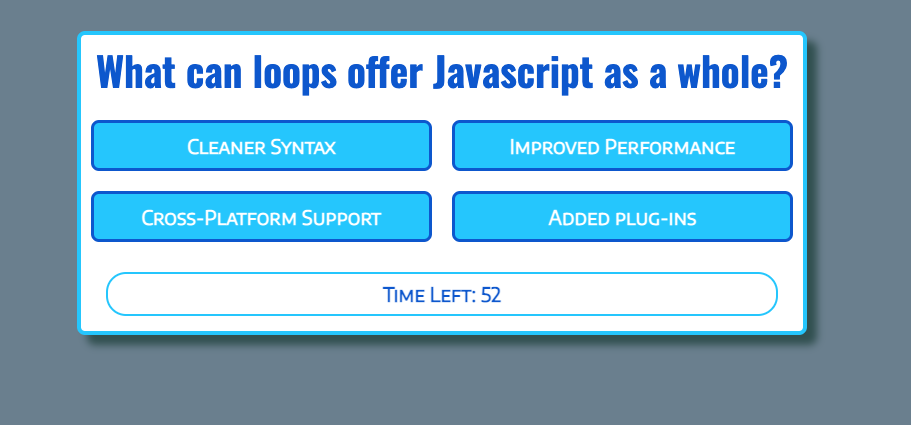

# Coding Quiz

## Description

This app was created using a combination of HTML, CSS, and JavaScript.
I created this app to test my knowledge of using all three languages together to create a fun game to test the user's knowledge of various development topics - against a sixty second timer.

## Usage

Using the Coding Quiz is very simple and starts with a large "Start Quiz!" button in the center of the viewport. I wanted the entire quiz to be inside of a "card" format with contrasting border to give it a more game-like effect.

Click on the "Start Quiz!" button and the game begins! The timer begins right away - so go quickly!

[Click here](https://evanarbour.github.io/coding-quiz/) to try the Coding Quiz.

## License

This project is licensed under the terms of the MIT license.

## Contact

Let's Connect! Reach me on:

- [Github](https://github.com/evanarbour)
- [LinkedIn](https://www.linkedin.com/in/evan-arbour/)
- [Email](evan.arbour@gmail.com)
